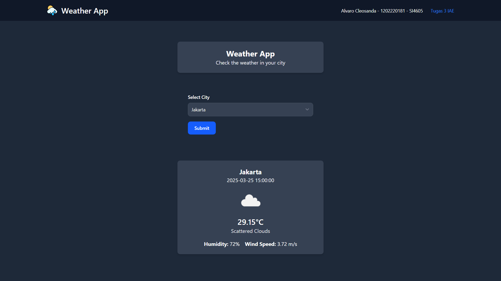

# 🌤️ Simple Weather App  

Aplikasi cuaca sederhana yang dibuat menggunakan **Express.js**, dan **OpenWeatherMap API** untuk mengambil dan menampilkan data cuaca berdasarkan kota yang dipilih.  

## Fitur  
* Cari cuaca berdasarkan nama kota  
* Mendukung input kota secara manual  
* Menampilkan suhu, kelembapan, kecepatan angin, dan kondisi cuaca  

## Instalasi dan Konfigurasi
1. Clone Repository ini: 
<br>
``` git clone https://github.com/alvaroocls/tugas3-IAE.git ``` <br> <br> ```cd weather-app```

2. Install Dependensi <br>
```npm install```

3. Jalankan aplikasi <br>
```npm start```

4. Buka browser dan akses <br>
`http://localhost:3000`


<br>
<br>
<br>





